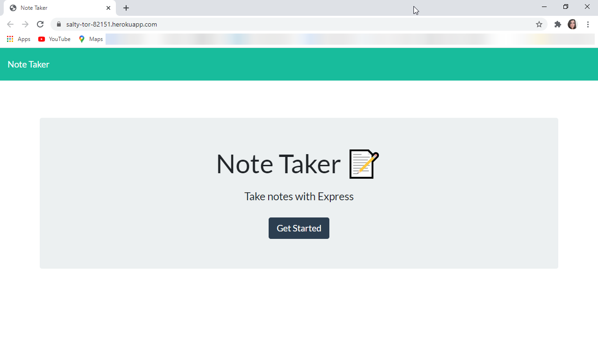
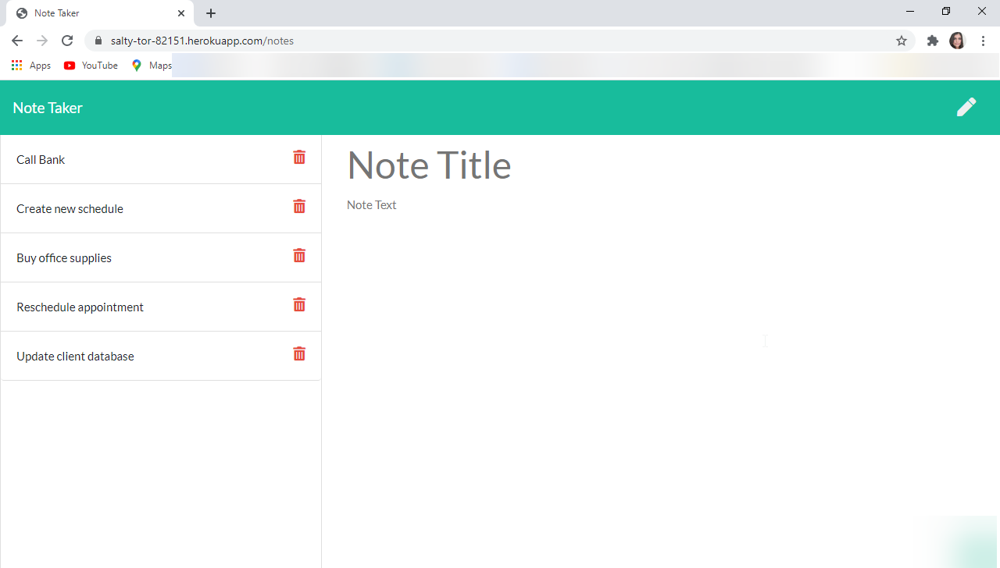
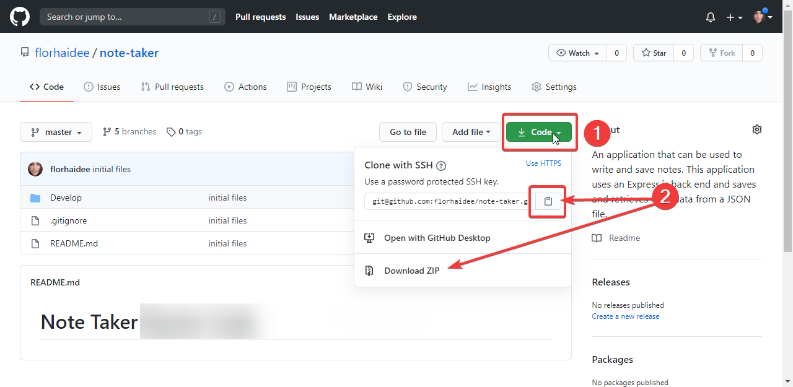
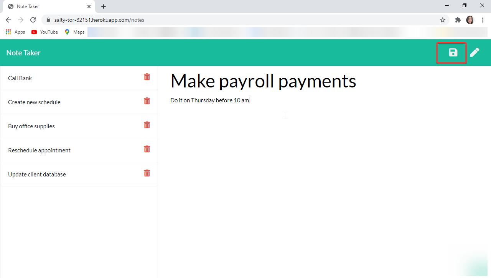
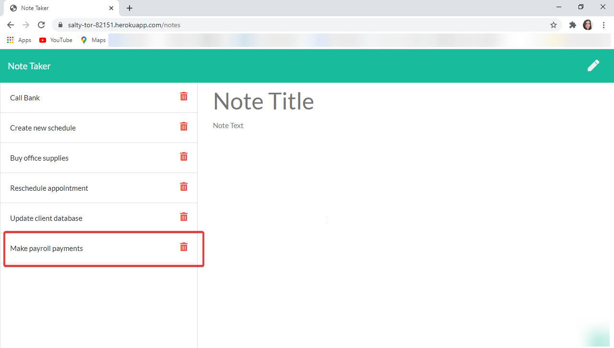
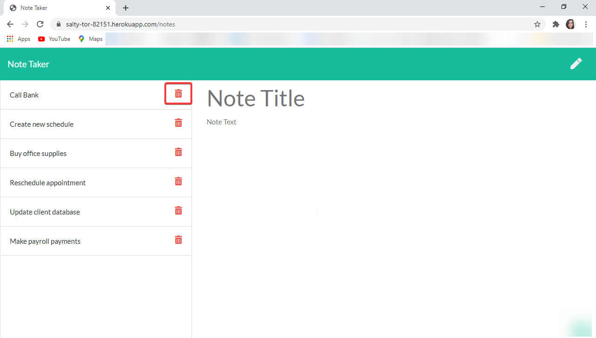

# Note Taker   [](code_of_conduct.md)

  ## Description 

  An application that can be used to write, save, and delete notes. This application uses an Express.js back end and saves and retrieves note data from a JSON file.

  


  When click on 'Get Started


  

 
  The page is presented with existing notes listed in the left-hand column, plus empty fields to enter a new note title and the note’s text in the right-hand column.


  ## Table of Contents 
  * [Installation](#installation)
  * [Usage](#usage)
  * [License](#license)
  * [Contributing](#contributing)
  * [Questions](#questions)
  


  ## Installation

    1. Download or clone this repository on your computer.

   

    2. To install all dependencies:

        * Open your editor and type the following command into your terminal, once you've navigated to the root directory of the project
        ```
        npm init 
        ```
        * Install all the dependencies using npm
        ```
        npm install -y
        ```


  ## Usage

  The link to the deployed application is: https://salty-tor-82151.herokuapp.com/

  You're presented with a landing page with a link to a notes page

  

  After click on 'Get Started'

  

  The page is presented with existing notes listed in the left-hand column, plus empty fields to enter a new note title and the note’s text in the right-hand column.

  When I new note is entered a Save icon appears in the navigation at the top of the page, to save the note:

   

  After a new note is saved, appears in the left-hand column with the other existing notes.

  

  To delete a note just click on the delete button on the right side of the notes.
   
  


  ## License

    Copyright © 2020 florhaidee. 
    Licensed under the MIT to see more about this license you can find it on the file 'license.txt' go to [MIT-license](./public/assets/MIT-license.txt) 


  ## Contributing 

    Please note that this project is released with a Contributor Code of Conduct. By participating in this project you agree to abide by its terms.
    Visit [Code of Conduct](https://www.contributor-covenant.org/version/2/0/code_of_conduct/) to have more information.

    To contribute 
     * Add an issue
     * Create a new branch with format-name: 
        - (feature/name/your-name) or (bug/name/your-name) 
     * Make a pull request.


  ## Questions

    If you have more questions about this application, you can contact me by:
      email: florhaideeg@gmail.com
      GitHub username: florhaidee


  ## ©️2020  Made with ❤️ by florhaidee


